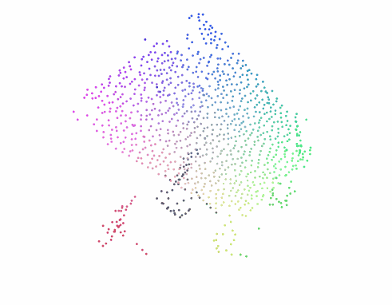
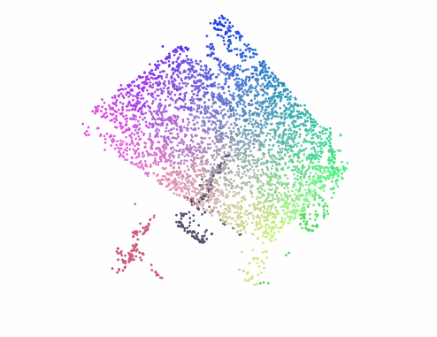

<div align="center">
  <h1 align="center">UR5e-DP-Family</h1>
  
  <br />
  
</div>

# 📖 Introduction

**UR5e-DP-Family** is a unified repository for building and deploying the **Diffusion Policy family on UR5e robots**. It provides a practical pipeline that spans **demonstration collection, dataset preparation, policy training, and real-world evaluation**.

The core methods in this repository belong to the **DP family**:

- `DP`: the **2D** Diffusion Policy based on image observations
- `DP_R3M`: the **2D** Diffusion Policy enhanced with an **R3M** visual encoder
- `DP3`: the **3D** Diffusion Policy based on point-cloud observations
- `DP3_OFFICIAL`: the official-style **3D** Diffusion Policy configuration
- `iDP3`: an enhanced **3D** Diffusion Policy with denser point-cloud representations

With this design, **UR5e-DP-Family** serves as a practical testbed for comparing and deploying **2D and 3D Diffusion Policy variants** on real UR5e platforms, from **single-arm** to **bimanual** manipulation.

# ⚙️ Hardware

- 🤖 `UR5e robotic arm`
- 🎮 `SpaceMouse` for single-arm, `VR` for bimanual teleoperation
- 📷 `Intel D400` series for `DP` and `DP_R3M`, `Intel L515` for `DP3`, `DP3_OFFICIAL`, and `iDP3`
- 🤏 `PGI gripper` or your own gripper

# 🛠️ Installation

```bash
conda create -n dp-family python=3.8
conda activate dp-family

pip install torch==2.1.0 torchvision --index-url https://download.pytorch.org/whl/cu121

pip install "git+https://github.com/facebookresearch/pytorch3d.git@stable"

pip install -r requirements.txt

cd third_party/robomimic-0.2.0
pip install -e . --no-deps
cd ../..

cd third_party/oculus_reader
pip install -e .
cd ../..

cd dp-family/visualizer
pip install -e .
cd ../..

cd dp-family
pip install -e .
cd ..

cd third_party/r3m
pip install -e .
cd ../..
```

# 🚀 Quick Start

## 1. 🕹️ Data Collection

- `Single-arm with SpaceMouse`

```bash
bash scripts/collect_data.sh data/ur5e_raw
```

- `Bimanual with VR`

```bash
UR5E_BIMANUAL=true UR5E_INPUT_DEVICE=quest \
bash scripts/collect_data.sh data/ur5e_bimanual_quest_raw
```
> 💡 Joint-Space Mode: `UR5E_ACTION_MODE=joint bash scripts/collect_data.sh data/ur5e_raw_joint`

Keyboard:
- `c`: Start recording
- `s`: Stop recording
- `h`: Move to the home pose
- `Backspace`: Drop the last episode
- `q`: Quit

## ▶️ Dataset Replay (Optional)

- `Replay single-arm episode`

```bash
bash scripts/replay_data.sh data/ur5e_raw 0
```

- `Replay bimanual episode`

```bash
UR5E_BIMANUAL=true \
bash scripts/replay_data.sh data/ur5e_bimanual_quest_raw 0
```

## 2. 🗂️ Data Preprocessing

- `Prepare DP3`

```bash
bash scripts/prepare_dp3.sh data/ur5e_raw
```

- `Prepare iDP3`

```bash
bash scripts/prepare_idp3.sh data/ur5e_raw
```
> 💡 `DP` does not require preprocessing

## 3. 🚆 Training

### Single-arm

- `Train DP Policy`

```bash
bash scripts/train_policy.sh dp base_dp single 0 0 eef
```
- `Train DP_R3M Policy`

```bash
bash scripts/train_policy.sh dp_r3m base_dp single 0 0 eef
```
- `Train DP3 Policy`

```bash
bash scripts/train_policy.sh dp3 base_dp3 single 0 0 eef
```

- `Train DP3_OFFICIAL Policy`

```bash
bash scripts/train_policy.sh dp3_official base_dp3 single 0 0 eef
```

- `Train iDP3 Policy`

```bash
bash scripts/train_policy.sh idp3 base_idp3 single 0 0 eef
```

### Bimanual Setup

```bash
export UR5E_IS_BIMANUAL=true
```

- `Train bimanual DP`

```bash
bash scripts/train_policy.sh dp base_dp bimanual 0 0 eef
```

- `Train bimanual DP_R3M`

```bash
bash scripts/train_policy.sh dp_r3m base_dp bimanual 0 0 eef
```

- `Train bimanual DP3`

```bash
bash scripts/train_policy.sh dp3 base_dp3 bimanual 0 0 eef
```

- `Train bimanual DP3_OFFICIAL`

```bash
bash scripts/train_policy.sh dp3_official base_dp3 bimanual 0 0 eef
```

- `Train bimanual iDP3`

```bash
bash scripts/train_policy.sh idp3 base_idp3 bimanual 0 0 eef
```

### 4. 🦾 Evaluation

### Single-arm

- `Run DP Policy`

```bash
bash scripts/eval_policy.sh dp base_dp single 0 0 eef
```

- `Run DP_R3M Policy`

```bash
bash scripts/eval_policy.sh dp_r3m base_dp single 0 0 eef
```

- `Run DP3 Policy`

```bash
bash scripts/eval_policy.sh dp3 base_dp3 single 0 0 eef
```

- `Run DP3_OFFICIAL Policy`

```bash
bash scripts/eval_policy.sh dp3_official base_dp3 single 0 0 eef
```

- `Run iDP3 Policy`

```bash
bash scripts/eval_policy.sh idp3 base_idp3 single 0 0 eef
```
### Bimanual Setup

```bash
export UR5E_IS_BIMANUAL=true
```

- `Run DP Policy`

```bash
bash scripts/eval_policy.sh dp base_dp bimanual 0 0 eef
```

- `Run bimanual DP_R3M Policy`

```bash
bash scripts/eval_policy.sh dp_r3m base_dp bimanual 0 0 eef
```

- `Run DP3 Policy`

```bash
bash scripts/eval_policy.sh dp3 base_dp3 bimanual 0 0 eef
```

- `Run bimanual DP3_OFFICIAL Policy`

```bash
bash scripts/eval_policy.sh dp3_official base_dp3 bimanual 0 0 eef
```

- `Run iDP3 Policy`

```bash
bash scripts/eval_policy.sh idp3 base_idp3 bimanual 0 0 eef
```

Keyboard:
- `c`: Start evaluation
- `s`: Stop evaluation
- `h`: Move to the home pose
- `q`: Quit

Common command format:

```bash
bash scripts/train_policy.sh <policy_name> <task_name> <tag> <seed> <gpu_id> [action_mode]
bash scripts/eval_policy.sh <policy_name> <task_name> <tag> <seed> <gpu_id> [action_mode]
```

# 📦 Data Format

The pipeline uses `zarr` datasets throughout.

Important keys produced or consumed by the scripts include:

- `camera_0_color`
- `camera_0_depth`
- `camera_0_intrinsics`
- `robot_eef_pose`
- `cartesian_action`
- `robot_joint`
- `joint_action`
- `point_cloud`
- `meta/episode_ends`

Policy input requirements::

- `DP` reads raw image replay data from `replay_buffer.zarr`
- `DP3` reads canonical point-cloud data from `state.zarr`
- `iDP3` reads denser point-cloud data from `state_idp3.zarr`

# ☁️ Visualizer

The point-cloud visualizer:

```bash
python scripts/visualize_dataset_pointcloud.py data/state.zarr
```

<div align="center">
  <table>
    <tr>
      <td align="center"><strong>DP3</strong></td>
      <td align="center"><strong>iDP3</strong></td>
    </tr>
    <tr>
      <td align="center"></td>
      <td align="center"></td>
    </tr>
  </table>
</div>

# 📄 License

This project is released under the [MIT License](LICENSE).

# 🙏 Acknowledgements

This work builds upon excellent open-source projects including [Diffusion Policy](https://github.com/real-stanford/diffusion_policy), [3D Diffusion Policy](https://github.com/YanjieZe/3D-Diffusion-Policy), [Improved 3D Diffusion Policy](https://github.com/YanjieZe/Improved-3D-Diffusion-Policy) and and [gello_software](https://github.com/wuphilipp/gello_software). We thank the authors and maintainers for their contributions.
